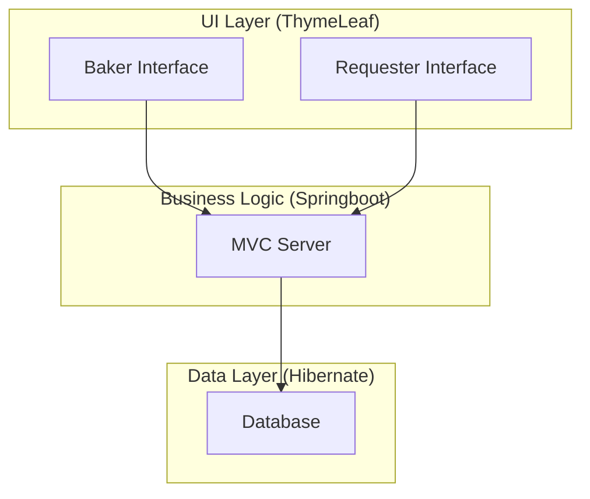

# CakeQuest.springboot
This is a server-side rendered Spring Boot cake request and baking application.

This application has two interfaces, one for the baker and one for the requester. The requester uses the application to request a cake.
There is an option for the requester to select the cake flavor, filling flavor, and frosting flavor from a list of flavors that are held
in a database. Additionally, there is an option in each section to request a new flavor (with or without a recipe). If the requester has
a specific recipe in mind, they are able to input it and have it added to the database. If the requester has a more general request, for 
example, "Orange Filling," they are able to leave the recipe blank and allow the baker to add their own recipe later. Next, there is the 
option for the requester to select from a list of common dietary restrictions. Finally, the requester has the option to add design requests 
in the form of a text box input and upload an inspiration picture.

The baker's interface notifies the baker when there has been a request and shows what the request is. If the flavors that have been selected
are associated with recipes, there is an ingredients list generated for each component. This list allows the baker to check off ingredients
that they already have in their pantry. If there is a flavor request that doesn't already have a recipe associated with it, the baker must
upload a recipe for that component. Once the pantry check is complete, the ingredient list will be consolidated into "store mode." For
example, if the baker needs 1 cup of cocoa powder for the frosting and 1.5 cups of cocoa powder for the cake, the consolidated "store mode"
list simply states to shop for 2.5 cups of cocoa powder. Once shopping is complete, the recipes are shown on different pages with the option
to toggle between the three recipes so they can be worked on simultaneously if needed. There is an option to mark "complete" for each 
component. Once all components are complete, the app shows the design notes and inspiration picture from the requester for the baker to 
reference while the cake is being assembled. Once assembly is complete, there is an option to take a picture of the completed cake and set
a date to share the picture with the requester. Setting a date to share the picture ensures that if the final result of the cake is a 
surprise, the requester won't see the picture until after their event.

