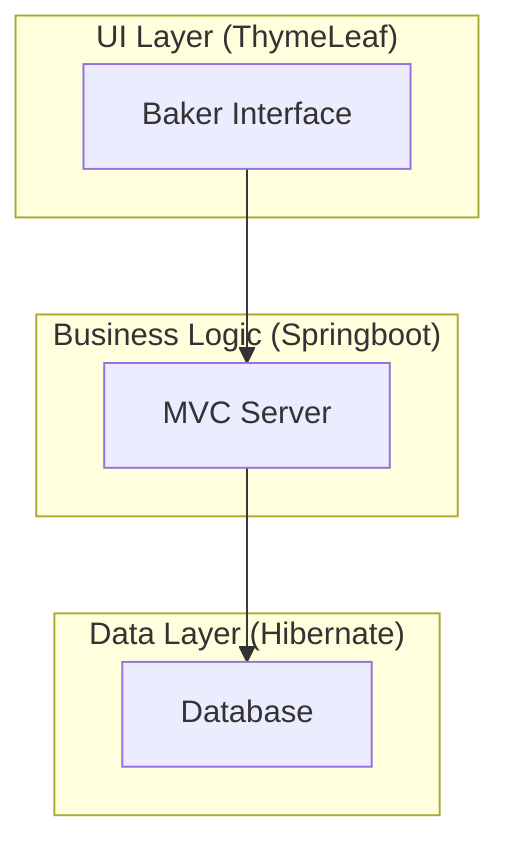
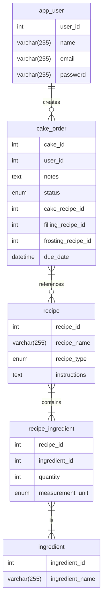

# CakeQuest.springboot
CakeQuest is a server side rendered Spring Boot web application that helps bakers organize and track their custom cake projects from start to finish.
With this application a baker is able to:
Create and manage custom cake projects

• Save a database of recipes, either imported via URL or created in app

• Select flavors for the cake, filling, and frosting from recipes they’ve saved

• View auto generated consolidated shopping lists for a cake project that merges quantities across all components

• Shop their pantry to update the auto generated shopping list and avoid duplicate purchases

• See a consolidated "store mode" shopping list that accounts for pantry stock

• Manage and customize cake baking timelines and receive notifications of task due dates

• Mark each component as complete

• Mark the cake as fully assembled and optionally upload a final photo

• Access a history of all cakes they’ve made

# Three Tiered Architecture

# ERD

